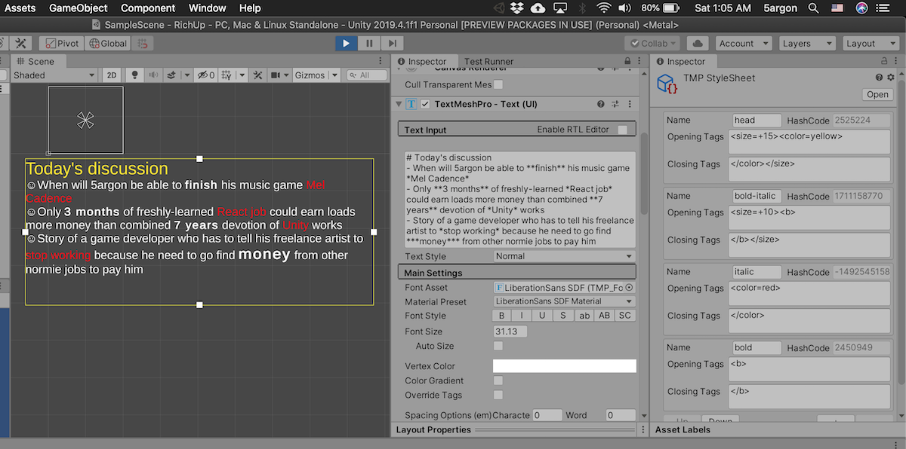

# RichUp

"Rich up" is when Markdown string turns into [rich text](http://digitalnativestudios.com/textmeshpro/docs/rich-text/) compatible with Unity TextMeshPro. Basically you can type an easier to read Markdown in the `TMP_Text` text box, and at runtime you see on screen as if you typed in tons of rich text tags.

The text you see in `TMP_Text` stays in their Markdown form even at runtime. It is possible to change the text in their Markdown form at runtime to generate their new rich text appearance.

Though only small subset of Markdown (that I personally wanted to use) is supported, I have added other rich, but unrelated functionalities : **named format items** and **symbols**.

## Prerequisites

It uses `ITextPreprocessor` feature that is currently only in preview versions of TMP right now (July 4, 2020). [Go check the changelog](https://docs.unity3d.com/Packages/com.unity.textmeshpro@latest) which one has it.

## How to use

- Attach `RichUpPreprocessor` component on the same game object as `TMP_Text`. Alternatively you can use custom target fields.
- Setup how to turn which Markdown into which rich text tags on the `config`. It is a big cumbersome tree of serialized data. There is no custom editor yet since I am lazy, but it works.
- Additionally create a new component that implements `IItemFormatter` to use named format items feature. (described below)

## Features

### Markdown subset

- Supports surrounding according to the following surrounding symbols : `*`, `**`, `***`, `` ` `` (italic, bold, italic-bold, inline code).
- Supports surrounding an entire line where beginning of line has these symbols followed by a single space bar : `#` (1-6), `-` (list), `>` (blockquote).

#### Surrounding options

- Style : Adds ``, so it could use [style sheet](http://digitalnativestudios.com/textmeshpro/docs/rich-text/#style) you assigned on the `TMP_Text` and in turn use any opening and closing tags defined on the style sheet asset file. This way I don't have to implement any other specific rich text tags.
- Custom : Specify any opening and closing string to surround.

### Named format items

Works like [C# format item](https://docs.microsoft.com/en-us/dotnet/api/system.string.format?view=netcore-3.1#insert-a-string), but instead of positional number you type a string name. This allows you to use `You got {item_name} x{item_amount}.` in your text resource.

Attach a component implementing `IItemFormatter` on the same game object as `RichUpPreprocessor`. You will get a method that will send you the name in `{}` bracket. You can then use `switch case` on it plus any custom logic to dynamically turns them into the correct string.

### Symbols

Symbol is a single `char`. You can config RichUp to replace it with any `string` of your choice. However it has one special ability, in addition to replacing the symbol, all other strings in between them also become surround targets. This surrounding only occurs if it found at least 1 symbol. Symbol works line by line.

For example this text `fo|obar foo|bar`, I could look for a symbol `|` then config it so the replacement is `@` and the surround is `<b>...</b>`. Therefore, the output is `<b>fo</b>@<b>obar foo</b>@<b>bar</b>`.

## What I use it for

- I don't enjoy typing rich text tags in long wall of text, like credits or in-game patch notes. Now I could just use Markdown.
- If you maintain a spreadsheet of text resource, possibly for multiple languages, you no longer have to bundle all the rich text tags in there. Emphasis are now just `*5argon*`, or `**5argon**`. You specify in Unity instead what should each one becomes. For example if you used to have a part of text colored green and red for things the player should do and should not do, you can use `*` for the red one and `**` for the green one instead of hard coding color hex code and have to repeat it for all languages.
- Each area of the game could treat "emphasis" differently with TMP stylesheet. Perhaps in different colors.
- I have easier time telling my translator to put emphasis (`*`) around something, rather than `<color=yellow></color>`.
- I was typing `{0}` and `{1}` and so on in my text resource in order to feed them into `String.Format` at runtime before putting the result on `TMP_Text`. Now I forgot what they are and it is even harder to tell the translator. I would like to use a string instead of numbers.
- The symbol feature was created specifically for this problem : To manually allow line break at specified position instead of at *every characters* in CJK languages, one has to combine `<nobr>` surrounding chunks of text that should not break, then use `<zwsp>` (zero-width space) to break similar to having a space bar without taking space. For example `日常に溶け込むシンプルなデザイン` if I would like to only allow it to break at `|` : `日常に|溶け込む|シンプルな|デザイン`, then the rich text required is : `<nobr>日常に</nobr><zwsp><nobr>溶け込む<nobr><zwsp><nobr>シンプルな</nobr><zwsp><nobr>デザイン</nobr>`. The line breaking information should be bundled in the text resource file, and obviously I would rather have `日常に|溶け込む|シンプルな|デザイン` saved in that file. (So I also could teach my translator more easily how to mark line break.) Then symbol feature then allows me to replace `|` with `<zwsp>` and surround the rest with `<nobr></nobr>`.
- The symbol could be useful to replace it with [sprite tag](http://digitalnativestudios.com/textmeshpro/docs/rich-text/#sprite). Find some single character glyph that represent a heart, to be replaced with a real heart sprite, for example.

## Performance notes

RichUp has no dependency to any Markdown processor library. The transformation was amateurly newly coded. There is no consideration for performance at all. It probably generates tons of garbages due to repeated `ToString` from `StringBuilder`, repeated `.Split`, and uses `Regex`. But I don't really care for the scenario that it is going to be used. (PR welcome!)